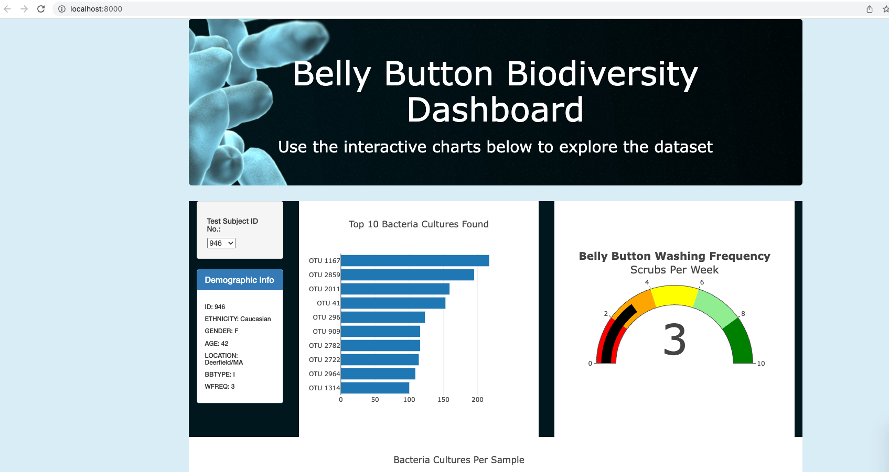
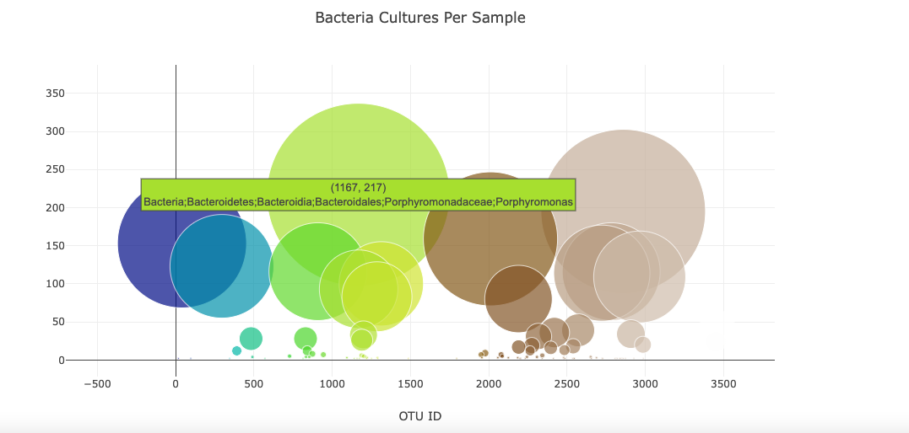

#  Belly Button Biodiversity

## Overview of the analysis:

Using my knowledge of JavaScript, Plotly, and D3.js,the purpose of this is to visualize bacterial data from volunteers.  We will create a horizontal bar chart to display the top 10 bacterial species (OTUs) when an individual’s ID is selected from a dropdown menu on the webpage.  We will also create a bubble chart to show the bacteria cultures per sample.  We also create a gauge chart that displays the weekly belly button washing frequency's as a measure from 0-10 when an individual ID is selected from the dropdown menu.

     

## Results:
 * Cultures Per Sample
      
     
